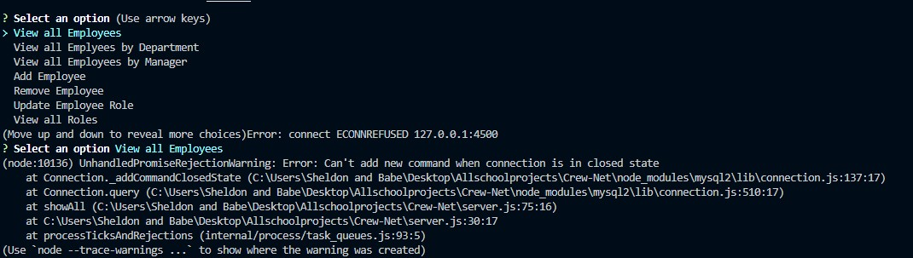

# Employee-List

 

## Description  
Broken

## Table of Contents
  * [Installation](#installation)
  * [Usage](#usage)
  * [Contributing](#contributing)
  * [Tests](#tests)
* [License](#license)

## Installation

*Steps required to install project:*

npm install mysql2 inquirer console.table, mysql installed, and node.js

## Usage 

*Instructions and examples for use:*

similar to install

## Tests

*Tests for application and how to run them:*

no tests

## License

MIT License

## Questions?

 

If you have any questions you can chat me up with the information below:

GitHub: [@sstevens22](https://api.github.com/users/sstevens22)

Contact info: Sendhelp@gmail.com

